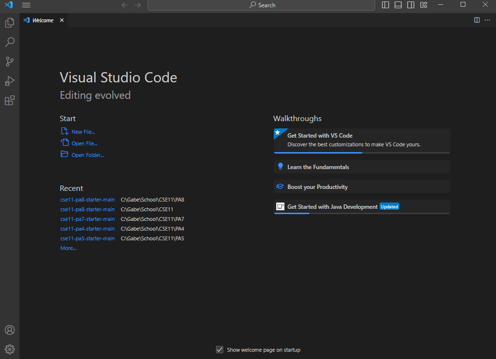
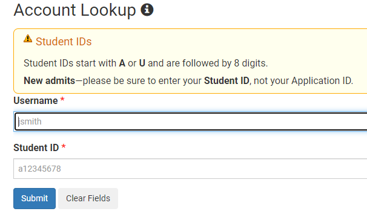
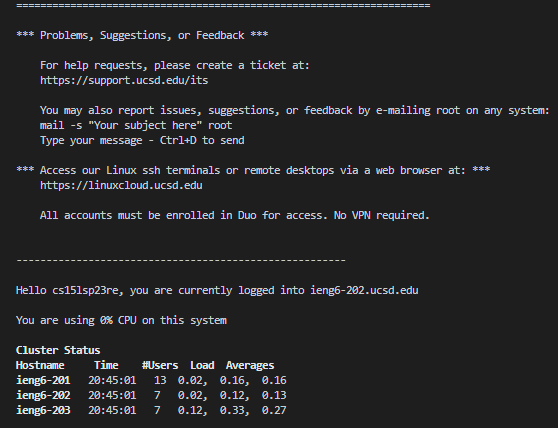
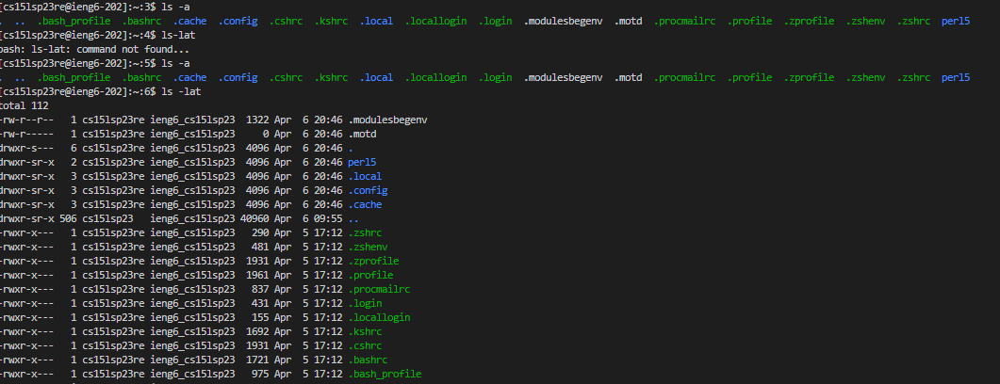

# Installing VS Code and Bit Dash
The steps I took in order to download VS code were not much because I had previously installed it.
However if you not installed it visit this [Link](https://code.visualstudio.com/)
and download the appropriate version for your device. Once done is should look similar to the image below.

The next step you will need to do is install git bash on VS code.
Follow this [Link](https://gitforwindows.org) and install git for your device.
Once installed and extracted, in the terminal of VS code there will now be a arrow
where you can access gitBash like the picture below


# Getting your Account and Remote Access
Now you will need to take this [Link](https://sdacs.ucsd.edu/~icc/index.php) and log in using your student id and username
the site should look like below.

Once logging in click on the button that starts with cs15lsp23 and then continue on and reset your password.
After doing this you should be able to use remote access on vs code, the first step to trying this is by
typing in the terminal ```ssh (your cs15lsp23 code)@ieng6.ucsd.edu``` do not include quotes and paste your code in the parenteheses but delete them after.
A prompt should pop up about connecting then type "yes" and then enter your password then something like this should appear:


# Trying out some commands
Next up is trying commands such as
```* cd ~```
```* cd```
```* ls -lat```
```* ls -a```

I tested the ls -lat command and ls -a command and got something like this below

