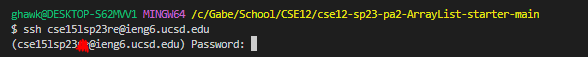
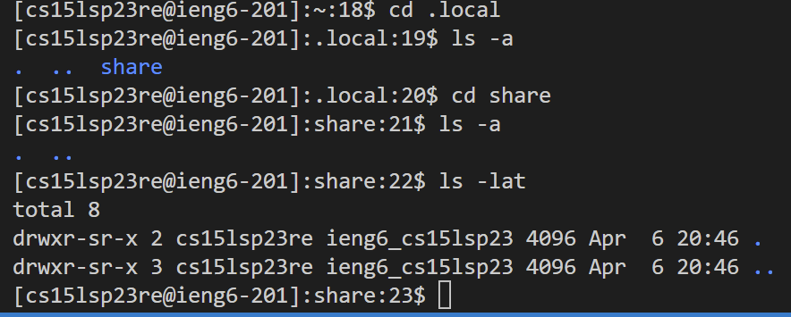

# Creating StringServer.java
First, I reviewed the previous search engine we were playing with in lab and tried to fully understand the code at hand.
I then applied the same engine that altered the numbers to alter the word that was being added by making it a lot more simple
and sdimply taking the string inside the specified index and then updating the page with it. Below is my code for StringSearch.java

The next step you will need to do is install git bash on VS code.
Follow this [Link](https://gitforwindows.org) and install git for your device.
Once installed and extracted, in the terminal of VS code there will now be a arrow
where you can access gitBash like the picture below


# Getting your Account and Remote Access
Now you will need to take this [Link](https://sdacs.ucsd.edu/~icc/index.php) and log in using your student id and username
the site should look like below.


Once logging in click on the button that starts with cs15lsp23 and then continue on and reset your password.
After doing this you should be able to use remote access on vs code, the first step to trying this is by
typing in the terminal ```ssh (your cs15lsp23 code)@ieng6.ucsd.edu``` do not include quotes and paste your code in the parenteheses but delete them after.It should look similar to below, I covered up my own ID in the red.

A prompt should pop up about connecting then type "yes" and then enter your password then something like this should appear:


# Trying out some commands
Next up is trying commands such as
* ```cd ~```
* ```cd```
* ```ls -lat```
* ```ls -a```
* ```ls <directory> where <directory> is /home/linux/ieng6/cs15lsp23/cs15lsp23abc, where the abc is one of the other group members’ username```
* ```cat /home/linux/ieng6/cs15lsp23/public/hello.txt```
*``` cp /home/linux/ieng6/cs15lsp23/public/hello.txt ~/```


I tested the ```ls -lat``` command and ```ls -a ```command and got something like this below

I also tested this using ```ls ```then ```cs .local```, then ```ls -a```, then ```cd share```

