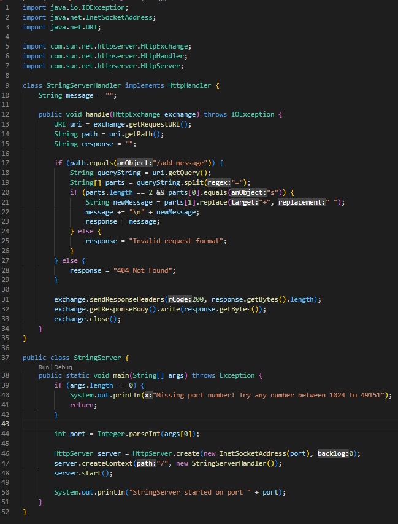
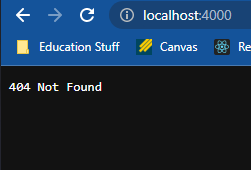
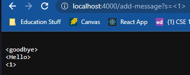
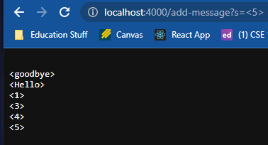

# Part 1 
## Creating StringServer.java  
First, I reviewed the previous search engine we were playing with in lab and tried to fully understand the code at hand.  
I then applied the same engine that altered the numbers to alter the word that was being added by making it a lot more simple  
and sdimply taking the string inside the specified index and then updating the page with it. Below is my code for StringSearch.java  

  
# Testing the StringSearch  
Next is using the command ```javac Server.java StringServer.java``` to run the files. Then to start  
the server you would use ```java StringServer``` to begin the server. You will end up with the page looking like this.  
  
At this point the server now works correctly and the methods handle are called where the string  
path is not equal to anything yet, so the code resorts to the else statemenet, "404 Not Found"  
Now, you can test the String aspect by typing ```/add-message?s=<string>``` where string  
is whatever you want it to be. Path is now equal to ```/add-message?s=<string>``` and the code then seperates path into  
queryString and parts where queryString signals that the user is adding a word and then the string newMessage is the word  
the user chose. It will then be printed on page like below. I tried the strings "goodbye", "hello" and "1".  
  
After these I tested more, I tried "3". "4", "5", the result is below. Each time I did a new String it calls handle and updates newMessage with the new word  
I want added and it makes sure the the path and parts are consistent otherwise it returns a error.  
  
# Part 2 
## Choosing a bug  
The bug I chose was in this code snipper  
```public class ArrayExamples {

  // Changes the input array to be in reversed order
  static void reverseInPlace(int[] arr) {
    for(int i = 0; i < arr.length; i += 1) {
      arr[i] = arr[arr.length - i - 1];
    }
  } 
  ```
The method is suppose to take a list that reverses the order without needing to make a new list and reasign the values in opposite order 
and returning the new one, this one simply alters the list. The tests I ran are  

  ```@Test
public void testReverseInPlace1(){
  int[] input1 = {1,2,3,4}
  ArrayExamples.reverseInPlace(input1);
  asserArrayEquals(new int[]{4,3,2,1}, input1); 
 ```
  
 The test above returns false because the order that it actually gives is {1,2,3,4} which is wrong because this method  
 is supposed to reverse the order of the array.  
 
  ```@Test
public void testReverseInPlace1(){
  int[] input1 = {1}
  ArrayExamples.reverseInPlace(input1);
  asserArrayEquals(new int[]{3}, input1);
  ```
  
  The test above returns true because since it is only 1 element in the array it just assigns it to the same spot and 
  that is correct.  
  
  
