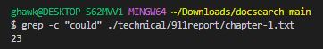
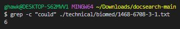
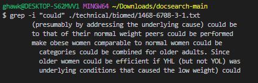
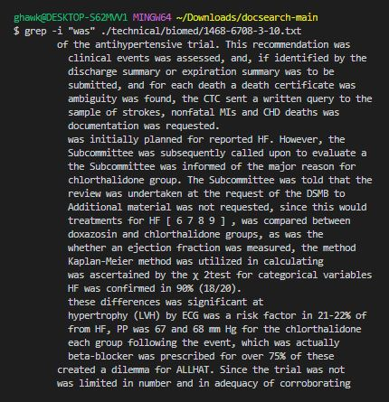
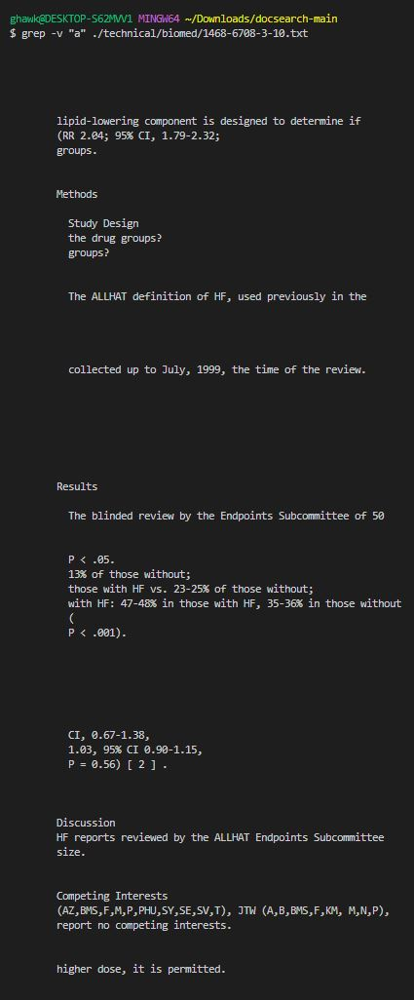
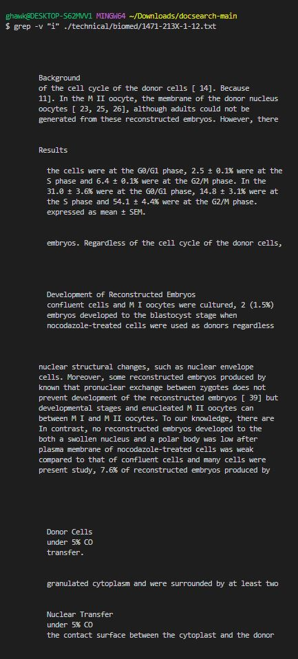
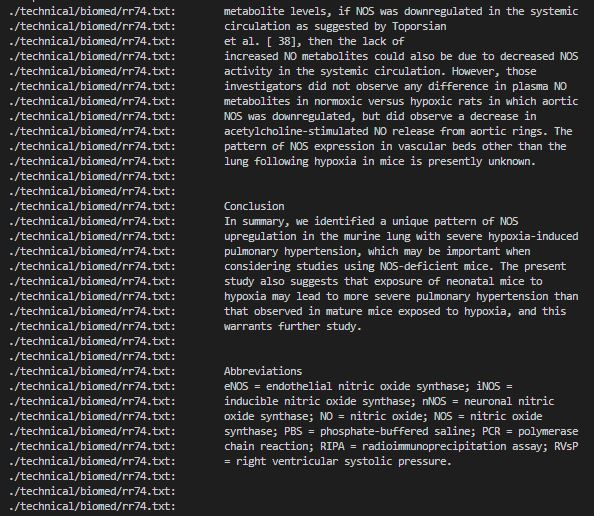
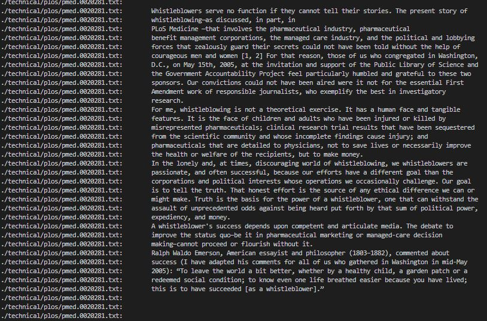

# Researching Commands
grep is a very useful command that searches for a pattern in text files. I will be finding ways
to incorperate grep with other options for interesting combinations.

## 1 ```grep -c "[search]" [path and file]```
The source for this was [ChatGPT](https://chat.openai.com/auth/login). System administrators often use ```grep -c``` to count the number of occurrences of certain keywords or error messages in log files. This helps them identify and troubleshoot issues more efficiently. For this was This combination will search for whatever you replace ```[search]```  (do not include brackets) and ```-c``` will count
the number of matching lines in the file and ```[path and file]``` is where you are searching.

### Example 1: ```grep -c "could" ./technical/biomed/1468-6708-3-1.txt```


In this example, we search for the word "could" in the file chapter-1.txt and it counts how many times it appears.
In this case it appears 23 times.

### Example 2 ```grep -c "could" ./technical/911report/chapter-1.txt```



In this example, we search for the word "could" in the file 1468-6708-3-1.txt and it counts how many times it appears.
In this case it appears 6 times.

## 2 ```grep -i "[search]" [path and file]```
The source for this was [ChatGPT](https://chat.openai.com/auth/login). Researchers or data analysts often work with large text datasets and need to search for specific keywords or phrases without being concerned about case sensitivity. The ```-i``` option in ```grep``` allows them to ignore case and retrieve all matches, regardless of whether the letters are uppercase or lowercase. This command will search for the word put in ```[search]``` (do not include brackets) in a case-insensitive manner in the file and return all the lines that match.

### Example 1 ```grep -i "could" ./technical/biomed/1468-6708-3-1.txt```


In this example, we search for the word "i" in the file 1468-6708-3-1.txt and it returns the lines it appears in
a line. In this case it appears in 6 lines.

### Example 2 ```grep -c "was" ./technical/biomed/1468-6708-3-10.txt```


In this example, we search for the word "i" in the file 1468-6708-3-10.txt and it returns the lines it appears in. In this case it appears in many lines and returns all of those lines.

## 3 ```grep -v  "[search]" [path and file]```
The source for this was [ChatGPT](https://chat.openai.com/auth/login). Filtering out irrelevant information: When processing log files or large datasets, users may want to exclude certain lines or entries that are not relevant to their analysis. By using ```grep -v```, they can specify a search pattern and exclude lines that contain that pattern, effectively filtering out irrelevant information. This command will search for all lines in the file that do not contain the word in ```[search]``` (do not include brackets).

### Example 1 ```grep -v "i" ./technical/biomed/1468-6708-3-1.txt```

 
In this example, we search for the word "i" in the file 1468-6708-3-10.txt and it returns the lines that do not contain "i". In this case it does not appear in many lines and returns all of those lines.

### Example 2 ```grep -v "i" ./technical/biomed/1471-213X-1-12.txt```


In this example, we search for the word "i" in the file 1471-213X-1-12.txt and it returns the lines that do not contain "a". In this case it does not appear in many lines and returns all of those lines.

## 4 ```grep -r "[search*search]" [path and file]```
The source for this was [ChatGPT](https://chat.openai.com/auth/login). When working with large datasets, you may need to extract specific patterns or information that cannot be easily captured with basic string matching. ```grep -E```allows you to leverage the power of regular expressions to perform more complex and nuanced searches, helping you find and extract the desired data patterns. This command uses extended regular expressions (-E option) to search for any string that starts with string followed by any number of characters and ends with the striong after the * in the file.

### Example 1 ```grep -r "a*an" ./technical/biomed//1471-213X-1-12.txt```
 

In this example, we search for the lines that have a word start with "a" and end with "an" in the file biomed/1471-213X-1-12.txt.

### Example 2  ```grep -r "t*an" ./technical/biomed/1471-230X-3-3.txt```
 

In this example, we search for the lines that have a word start with "t" and end with "an" in the file biomed/1471-230X-3-3.txt.
