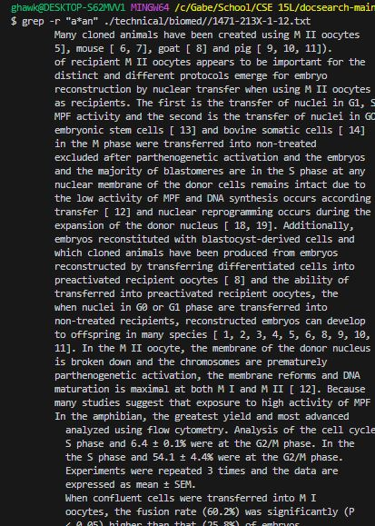
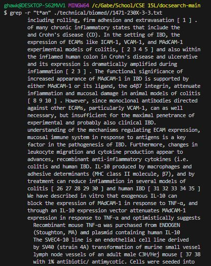

# Researching Commands
grep is a very useful command that searches for a pattern in text files. I will be finding ways
to incorperate grep with other options for interesting combinations.

## 1 ```grep -c "[search]" [path and file]```
This combination will search for whatever you replace ```[search]```  (do not include brackets) and ```-c``` will count
the number of matching lines in the file and ```[path and file]``` is where you are searching.
### Example 1

In this example, we search for the word "could" in the file chapter-1.txt and it counts how many times it appears.
In this case it appears 23 times.
### Example 2

In this example, we search for the word "could" in the file 1468-6708-3-1.txt and it counts how many times it appears.
In this case it appears 6 times.


## 2 ```grep -i "[search]" [path and file]```
This command will search for the word put in ```[search]``` (do not include brackets) in a case-insensitive manner in the file and return all the lines that match.
### Example 1

In this example, we search for the word "i" in the file 1468-6708-3-1.txt and it counts how many lines it appears in
a line. In this case it appears in 6 lines.
### Example 2

In this example, we search for the word "i" in the file 1468-6708-3-10.txt and it counts how many lines it appears in. In this case it appears in many lines and returns all of those lines.

## 3 ```grep -v  "[search]" [path and file]```
This command will search for all lines in the file that do not contain the word in ```[search]``` (do not include brackets).
### Example 1

### Example 2


## 4 ```grep -v"[search]" [path]/*```
This command will search for all lines in all the files inside the technical directory that do not contain the word in 
```[search]``` (do not include brackets) and return them along with the filenames.
### Example 1

### Example 2

