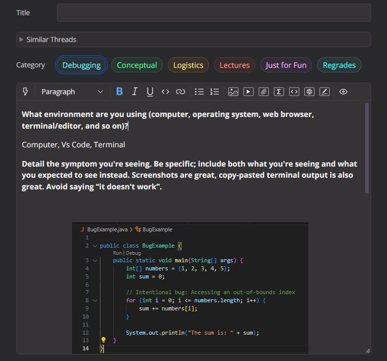
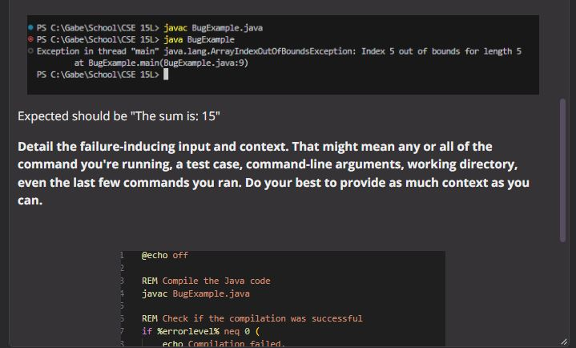
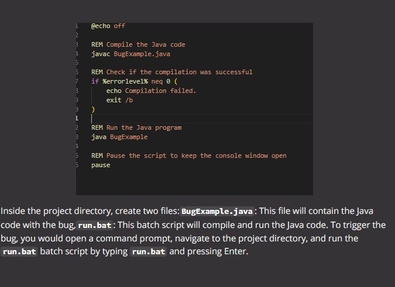

## Step 1: Edstem quesiton
  

  

## Step 2: A response from a TA asking a leading question or suggesting a command to try
To fix the bug, you should try to edit the following line in BugExample.java:

```for (int i = 0; i <= numbers.length; i++)```
```for (int i = 0; i < numbers.length; i++)```

