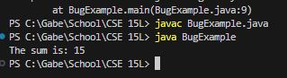

# Part 1
## Step 1: Edstem quesiton
  

  

## Step 2: A response from a TA asking a leading question or suggesting a command to try
To fix the bug, you should try to edit the following line in BugExample.java:

```for (int i = 0; i <= numbers.length; i++)```

```for (int i = 0; i < numbers.length; i++)```

## Step 3: Student Fixing the Bug


The bug was djusting the loop condition to iterate up to numbers.length - 1, preventing the ArrayIndexOutOfBoundsException when accessing the array element. After making this change and re-running the run.bat script, the program will execute without errors, producing the expected output of "The sum is: 15" in the terminal.

# Part 2: Reflection
Something cool I liked this quarter was working wish Bash codes, making quick codes by yourself that you are able to call in the terminal was
really cool. Also getting to make our own autograder was cool, I got to experience how they really work behind the scenes.
