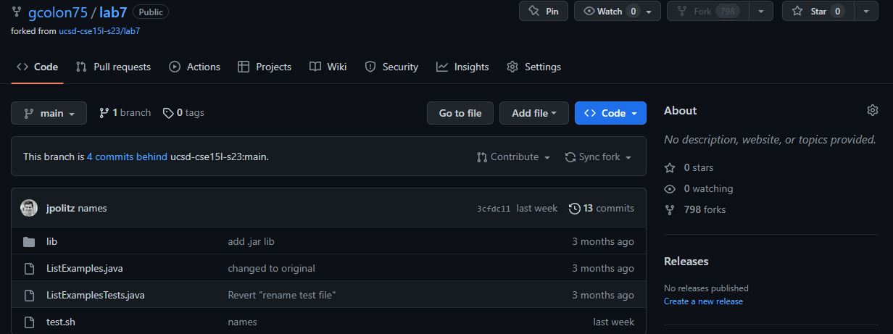
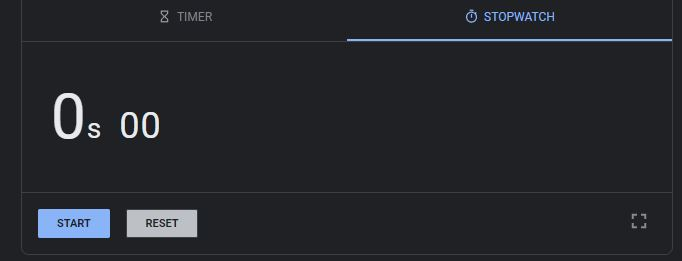
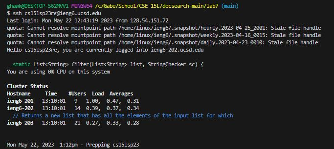
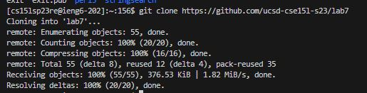
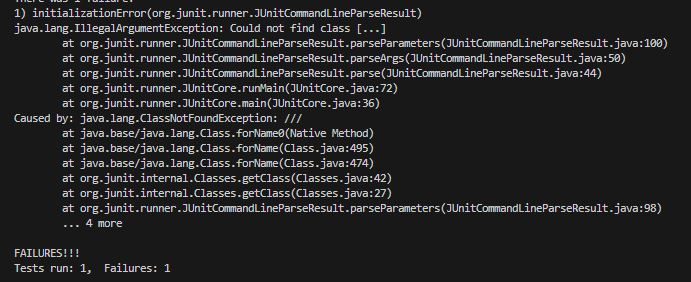
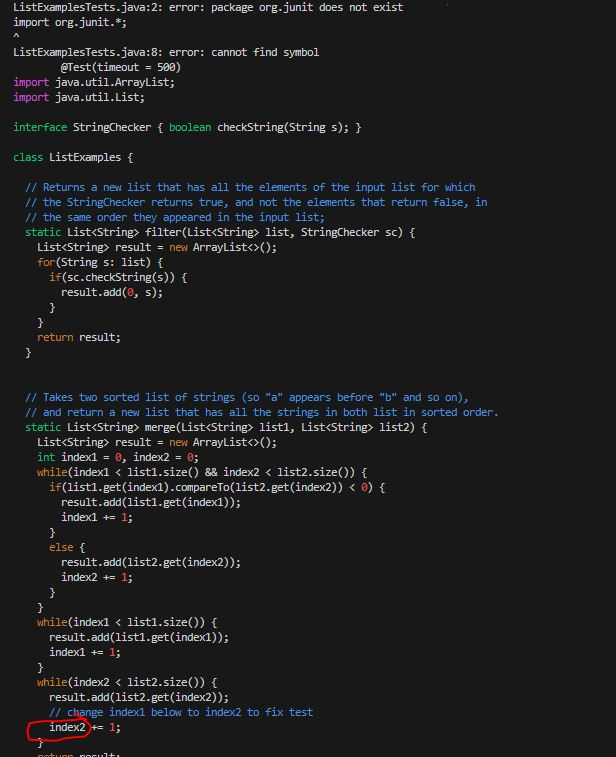
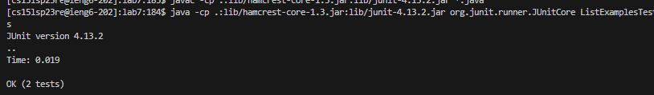
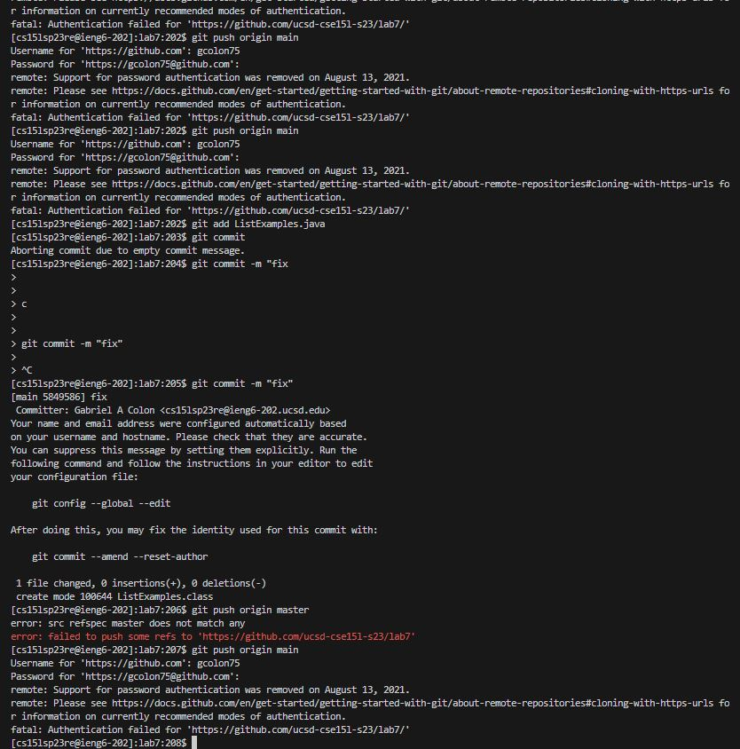

## Step 1:Setup was not shown because it was not forked in the first place.

## Step 2:Here I forked the reposistory

## Step 3: Here is an image of the timer starting.

## Step 4: Logging into ieng6 (just typed it out)

## Step 5: Clone your fork of the repository from your Github account (just typed it out and copy pasted clone)

## Step 6: Run the tests, demonstrating that they fail (copy pasted)

## Step 7: Edit the code file to fix the failing test 

42 j, 12 l, c, <backspace>, 2, <esc> :wq!
  
## Step 8: Run the tests, demonstrating that they now succeed (<up arrow> <up arrow> <enter>)
  

  
## Step 9: Commit and push the resulting change to your Github account (you can pick any commit message!) (fully typed out)
  

